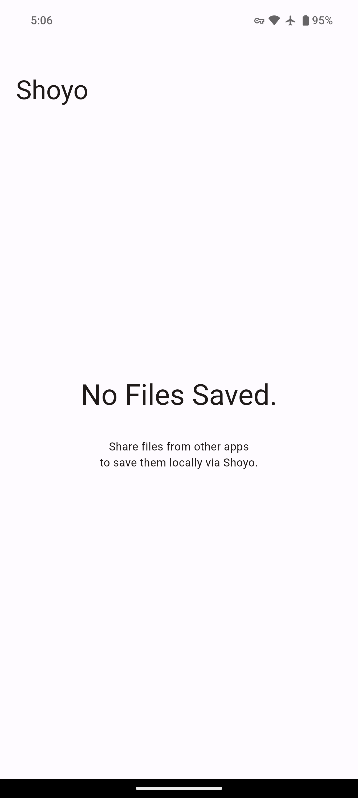
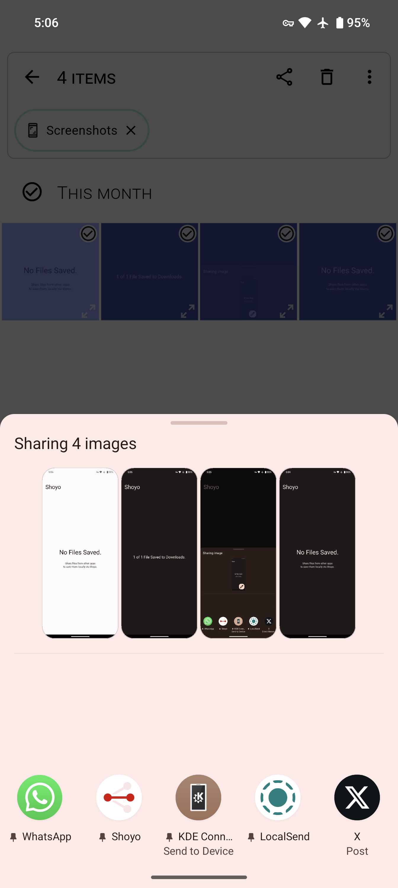
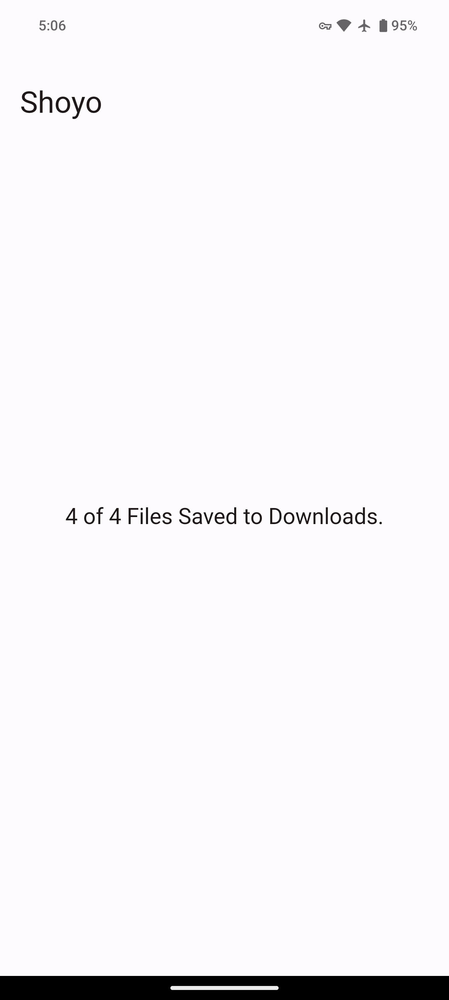
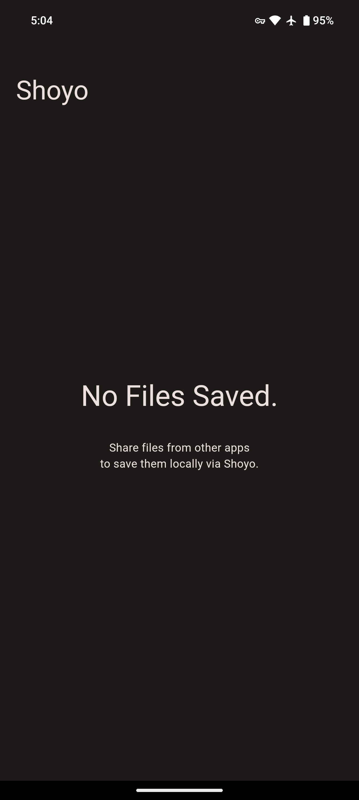

# Shoyo

Save files from the Android Share Sheet to local storage.

A more modern version of ["Send to SD card"](https://f-droid.org/packages/ru.gelin.android.sendtosd/).

## Screenshots

|  |            |
| ------------------------------------------------------ | ----------------------------------------------------------------------- |
|    |  |